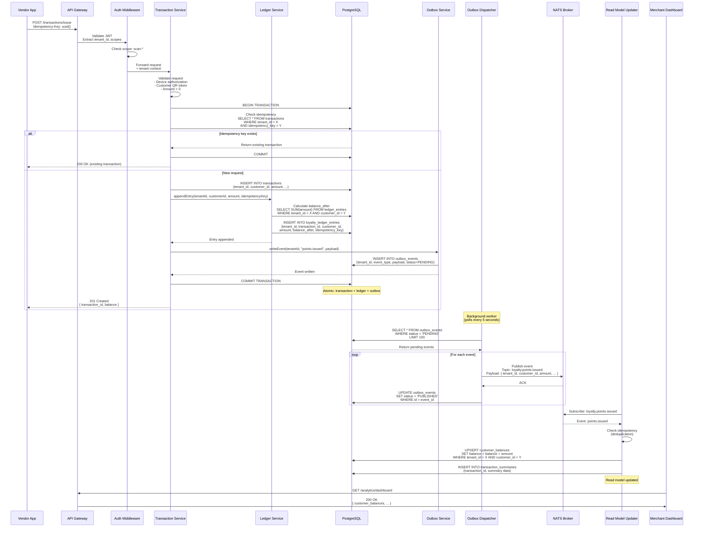
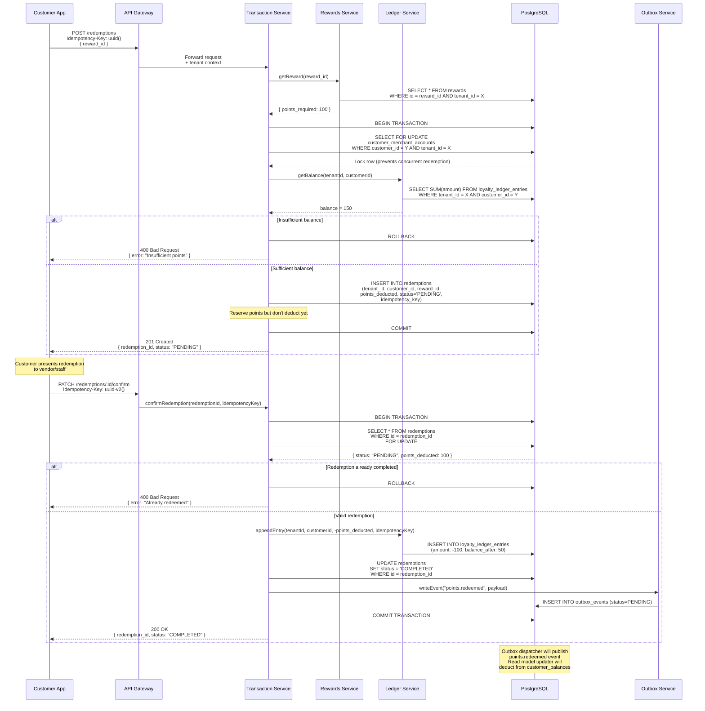
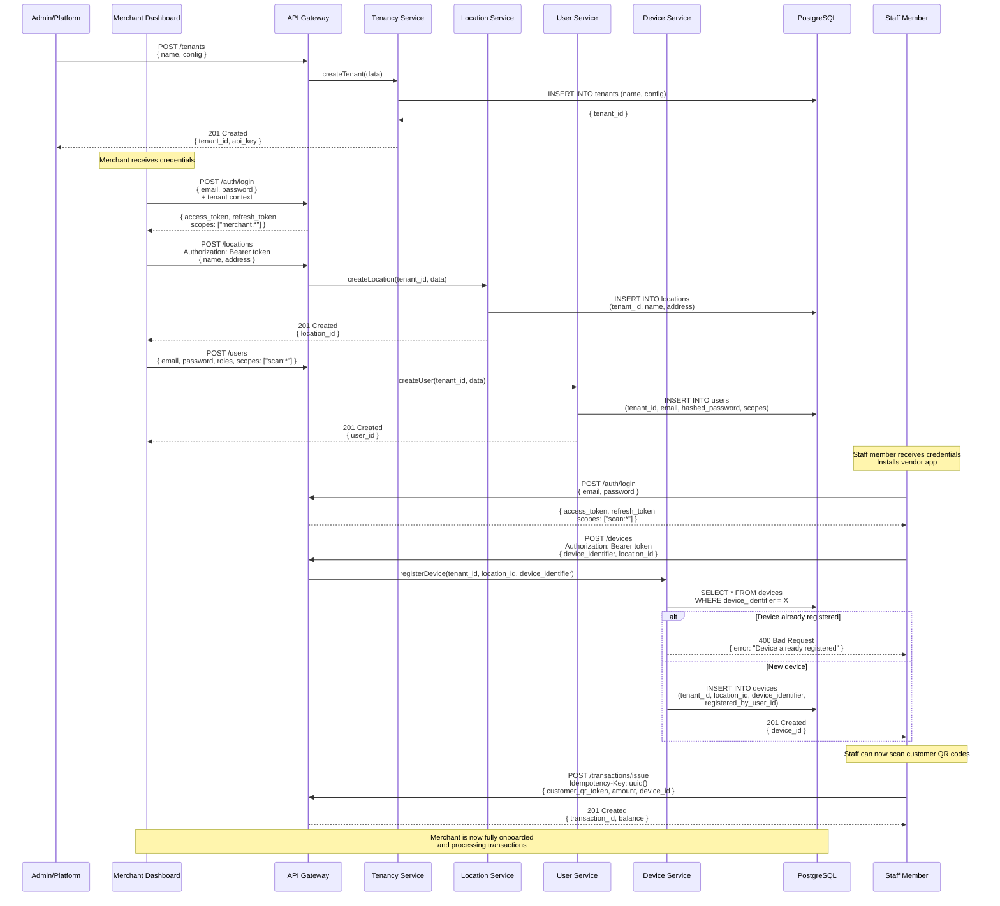
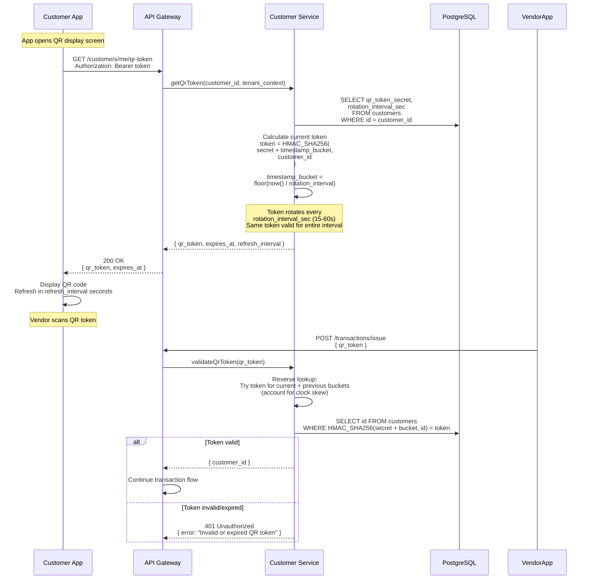

# SharkBand Critical Flows

This document describes the key operational flows in the SharkBand platform using sequence diagrams.

## 1. Unified Transaction Pipeline: Points Issuance

This flow demonstrates the complete end-to-end process from a vendor scan to read model updates.

### Key Points:
- **Idempotency**: Same `Idempotency-Key` returns existing transaction
- **Atomicity**: Transaction, ledger entry, and outbox event written in single DB transaction
- **Eventual Consistency**: Read models updated asynchronously via NATS
- **Tenant Isolation**: All queries filtered by `tenant_id` from JWT claims

## 2. Reward Redemption with Double-Spend Prevention

This flow demonstrates the 2-step redemption process with protection against double-spending.

### Key Points:
- **2-Step Process**: Initiate → Confirm (prevents accidental redemptions)
- **Double-Spend Prevention**: `SELECT FOR UPDATE` locks account during balance check
- **Idempotency**: Confirm endpoint also idempotent (same key = no duplicate deduction)
- **Status Tracking**: Redemption moves PENDING → COMPLETED (or FAILED)

## 3. Merchant Onboarding Flow

This flow shows the complete setup process for a new merchant joining the platform.

### Key Points:
- **Progressive Setup**: Tenant → Location → Staff → Device → First Transaction
- **Scope Assignment**: Staff users get `scan:*` scope, merchant owners get `merchant:*`
- **Device Binding**: Each device tied to location and registered user
- **First Transaction**: Validates entire onboarding chain

## 4. Customer QR Token Rotation

This flow shows how customer QR tokens are securely rotated server-side.

### Key Points:
- **Server-Side Rotation**: Token generated server-side, not client-side
- **Time-Based Bucketing**: Token valid for entire interval (15-60s), prevents race conditions
- **HMAC Signing**: Token is signed hash, cannot be forged
- **Clock Skew Tolerance**: Validates against current + previous bucket
